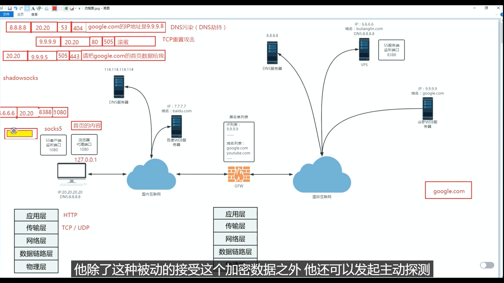

# DNS污染

DNS污染是指在域名解析过程中，恶意的第三方篡改了DNS响应，将用户请求的域名解析到错误的IP地址或者重定向到恶意的网站。这种攻击可以导致用户访问受限、被劫持或者受到恶意软件的感染。

DNS污染的常见形式包括：

1. DNS劫持：攻击者篡改了DNS响应，将用户请求的域名解析到攻击者控制的服务器上。这样，用户在访问原本的网站时，实际上会被重定向到恶意的网站。

2. DNS缓存投毒：攻击者向DNS服务器发送伪造的DNS响应，将错误的域名解析结果存储在DNS缓存中。这样，其他用户在访问相同的域名时，会从缓存中获取错误的解析结果。

3. DNS欺骗：攻击者伪造了DNS响应，将错误的IP地址与域名绑定。这样，用户在访问该域名时，会被解析到错误的IP地址上。

为了防止DNS污染，可以采取以下措施：

1. 使用可信任的DNS服务器：选择使用可信任的DNS服务器，如ISP提供的DNS服务器或者公共的DNS服务器（如Google Public DNS、OpenDNS等），以减少受到DNS污染的风险。

2. 使用DNSSEC：DNSSEC（Domain Name System Security Extensions）是一种用于保护DNS解析过程的安全扩展。它通过数字签名来验证DNS响应的真实性和完整性，防止DNS污染和DNS劫持攻击。

3. 定期清除DNS缓存：定期清除本地计算机或路由器上的DNS缓存，以避免使用被污染的缓存。

4. 使用HTTPS：使用HTTPS加密协议访问网站，可以减少DNS污染对用户数据的篡改和劫持。

总之，保持警惕并采取适当的安全措施可以帮助减少DNS污染对用户的影响。

# SNI阻断

SNI阻断是指通过阻止或篡改服务器名称指示（Server Name Indication，简称SNI）字段，来干扰或阻止加密通信的一种手段。SNI是TLS协议的扩展，用于在客户端与服务器之间建立加密连接时，告知服务器所请求的主机名。

SNI阻断的常见形式包括：

1. 深度包检测（DPI）：攻击者使用DPI技术检测网络流量中的SNI字段，并根据SNI字段的内容来阻断或篡改加密通信。这种技术通常被用于审查或限制特定类型的流量，如屏蔽翻墙工具或限制特定网站的访问。

2. DNS劫持：攻击者篡改DNS响应，将用户请求的域名解析到错误的IP地址。这样，当客户端发送TLS握手请求时，SNI字段中的主机名将不匹配实际的服务器，导致加密连接失败。

3. 中间人攻击：攻击者冒充服务器与客户端建立连接，并在握手过程中篡改SNI字段，使其指向错误的主机名。这样，客户端与攻击者建立了加密连接，而不是与实际的服务器建立连接。

为了防止SNI阻断，可以采取以下措施：

1. 使用加密隧道：使用加密隧道技术，如VPN或代理服务器，将所有的通信流量加密并通过一个中间节点传输。这样，攻击者无法检测到SNI字段，从而无法进行阻断或篡改。

2. 使用DNS over HTTPS（DoH）或DNS over TLS（DoT）：使用DoH或DoT将DNS查询加密，并通过HTTPS或TLS协议发送。这样，攻击者无法篡改DNS响应，从而无法进行SNI阻断。

3. 使用SNI隐藏技术：一些工具或服务提供了SNI隐藏的功能，可以将SNI字段加密或隐藏，使其不容易被检测到或篡改。

4. 使用其他加密协议：除了TLS协议，还可以考虑使用其他加密协议，如IPsec，来建立加密通信，以避免SNI阻断的影响。

需要注意的是，SNI阻断可能是由于政府、网络服务提供商或其他恶意行为者的限制或攻击所导致的。在面对SNI阻断时，建议谨慎处理，并遵守当地的法律和规定。

# TCP重置

TCP重置（TCP reset）是一种TCP协议中的控制报文，用于终止或重建TCP连接。当一方收到TCP重置报文时，它会立即关闭与对方的连接，并且后续的数据传输将被终止。

TCP重置常见的应用场景包括：

1. 异常连接终止：当一个TCP连接出现异常情况时，如网络故障、协议错误或应用程序异常，一方可以发送TCP重置报文来终止连接，以便重新建立一个新的连接。

2. 拒绝连接：当服务器或防火墙检测到非法连接请求或攻击行为时，可以发送TCP重置报文来拒绝连接。这样，客户端将收到重置报文并关闭连接。

3. 连接重置：在某些情况下，一方可能希望重置连接的状态，以便重新开始数据传输。例如，当需要重新协商加密参数或重新同步连接状态时，可以发送TCP重置报文。

TCP重置报文由TCP头部中的标志位RST（Reset）字段标识。当一方发送TCP重置报文时，另一方将收到该报文并对其进行处理。接收方可以根据重置报文的标志位来关闭连接或执行其他操作。

需要注意的是，TCP重置是一种强制终止连接的手段，它可以中断正在进行的数据传输并导致连接的关闭。因此，在使用TCP重置时需要谨慎，确保只在必要的情况下使用，并遵守相关的网络协议和规定。

# 传统VPN的问题

# 专为翻墙而生的shadowsocks

