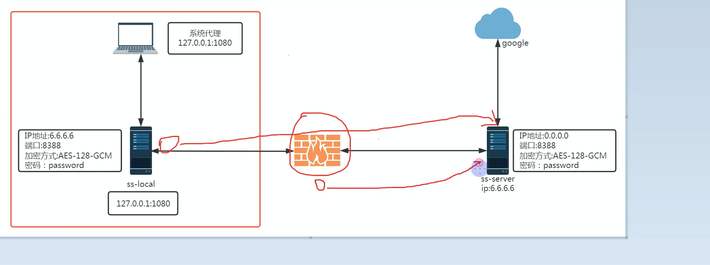
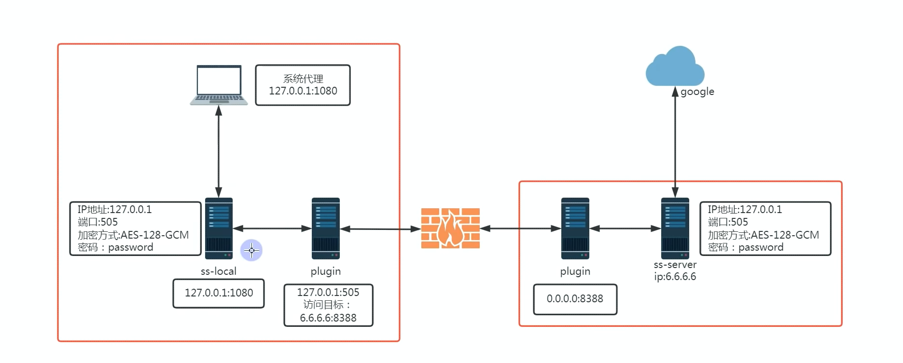

连接VPS之后就开始搭建`shadowsocks`节点，在尝试连接的时候从日志中发现了`GFW的主动探测`，导致节点端口被秒封，可以认为SS协议存在被精准探测的情况，针对这种情况，引入了`v2ray-plugin`插件，将SS协议的数据封装成http协议的数据实现伪装，顺利绕过了GFW的主动探测。

教程用到的工具：
SSH连接工具（FinalShell）：[http://www.hostbuf.com/t/988.html](https://bulianglin.com/g/aHR0cDovL3d3dy5ob3N0YnVmLmNvbS90Lzk4OC5odG1s)
SS客户端(shadowsocks-windows)： [https://github.com/shadowsocks/shadowsocks-windows](https://bulianglin.com/g/aHR0cHM6Ly9naXRodWIuY29tL3NoYWRvd3NvY2tzL3NoYWRvd3NvY2tzLXdpbmRvd3M)
shadowsocks插件(v2ray-plugin)：[https://github.com/shadowsocks/v2ray-plugin](https://bulianglin.com/g/aHR0cHM6Ly9naXRodWIuY29tL3NoYWRvd3NvY2tzL3YycmF5LXBsdWdpbg)
方便测速但不支持ss插件(v2rayN)：[https://github.com/2dust/v2rayN](https://bulianglin.com/g/aHR0cHM6Ly9naXRodWIuY29tLzJkdXN0L3YycmF5Tg)

**shadowsocks相关命令：**

```shell
# 安装shadowsocks
apt install shadowsocks-libev
# 查看shadowsocks状态
systemctl status shadowsocks-libev.service
# 编辑ss配置文件
vim /etc/shadowsocks-libev/config.json
# 重启shadowsocks
systemctl restart shadowsocks-libev.service
# 查看shadowsocks运行日志：
journalctl -u shadowsocks-libev.service -f
# 插件
apt install shadowsocks-v2ray-plugin

root@vultr:~# dpkg -L shadowsocks-v2ray-plugin
```

```shell
{
    "server":"0.0.0.0",
    "mode":"tcp_and_udp",
    "server_port":8388,
    "local_port":1080,
    "password":"1jU3P7avAqqw",
    "timeout":86400,
    "method":"chacha20-ietf-poly1305"
}

```

```shell
{
    "server":"0.0.0.0",
    "mode":"tcp_and_udp",
    "server_port":17388,
    "local_port":1080,
    "password":"1jU3P7avAqqw",
    "timeout":86400,
    "method":"chacha20-ietf-poly1305",
    "plugin":"ss-v2ray-plugin",
    "plugin_opts":"server"
}

```

**Ubuntu防火墙设置：**

```shell
# 查看状态
ufw status
# 开放端口
ufw allow 8388
# 拒绝端口
ufw deny 8388
# 删除规则
ufw delete allow 8388
# 关闭防火墙
ufw disable
# 启动防火墙
ufw enable
```



