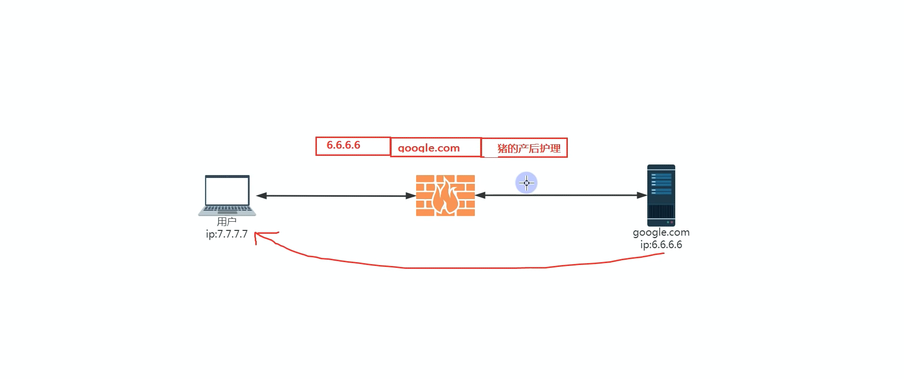
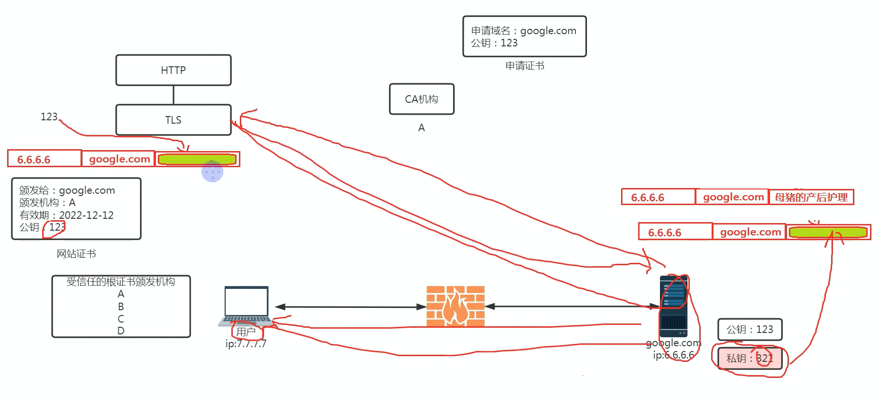

**本节可以说是整个系列最重要的一节，给大家科普了什么是`http(s)/tls(ssl)/网站证书/公钥/私钥/非对称加密`，将会贯穿后面所有内容，因为任何基于TLS的节点都离不开本节讲的内容，而目前最稳定的科学上网方式依然是将流量伪装成https，是逃不开的，建议仔细观看**

SSH连接工具（FinalShell）：[http://www.hostbuf.com/t/988.html](https://bulianglin.com/g/aHR0cDovL3d3dy5ob3N0YnVmLmNvbS90Lzk4OC5odG1s)
trojan-go：[https://github.com/p4gefau1t/trojan-go](https://bulianglin.com/g/aHR0cHM6Ly9naXRodWIuY29tL3A0Z2VmYXUxdC90cm9qYW4tZ28)
trojan-go官方文档：[https://p4gefau1t.github.io/trojan-go/](https://bulianglin.com/g/aHR0cHM6Ly9wNGdlZmF1MXQuZ2l0aHViLmlvL3Ryb2phbi1nby8)

**trojan配置文件：**

```shell
{
    "run_type": "server",
    "local_addr": "0.0.0.0",
    "local_port": 443,
    "remote_addr": "192.83.167.78",#伪装地址
    "remote_port": 80,
    "password": [
        "your_awesome_password"#密码可修改
    ],
    "ssl": {
        "cert": "server.crt",
        "key": "server.key"
    }
}
```

**申请证书：**

```shell
#安装acme：
curl https://get.acme.sh | sh
#安装socat：
apt install socat
#添加软链接：
ln -s  /root/.acme.sh/acme.sh /usr/local/bin/acme.sh
#注册账号： 
acme.sh --register-account -m my@example.com
#开放80端口：
ufw allow 80
#申请证书： 
acme.sh  --issue -d 替换为你的域名  --standalone -k ec-256
#安装证书： 
acme.sh --installcert -d 替换为你的域名 --ecc  --key-file   /root/trojan/server.key   --fullchain-file /root/trojan/server.crt 

#如果默认CA无法颁发，则可以切换下列CA：
#切换 Let’s Encrypt：
acme.sh --set-default-ca --server letsencrypt
#切换 Buypass：
acme.sh --set-default-ca --server buypass
#切换 ZeroSSL：
acme.sh --set-default-ca --server zerossl
```

**自签证书：**

```shell
#生成私钥：
openssl ecparam -genkey -name prime256v1 -out ca.key
#生成证书：
openssl req -new -x509 -days 36500 -key ca.key -out ca.crt  -subj "/CN=bing.com"
```

**后台运行：**

```shell
nohup ./trojan-go > trojan.log 2>&1 &
```



