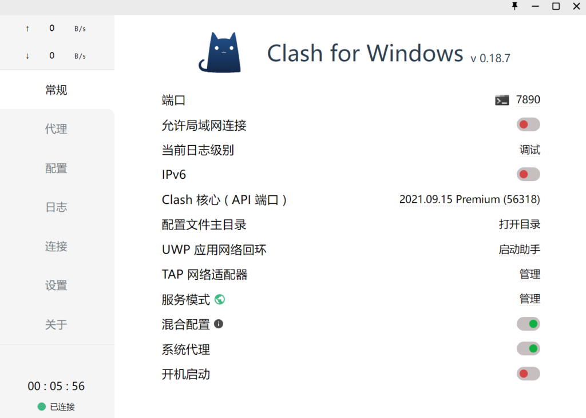
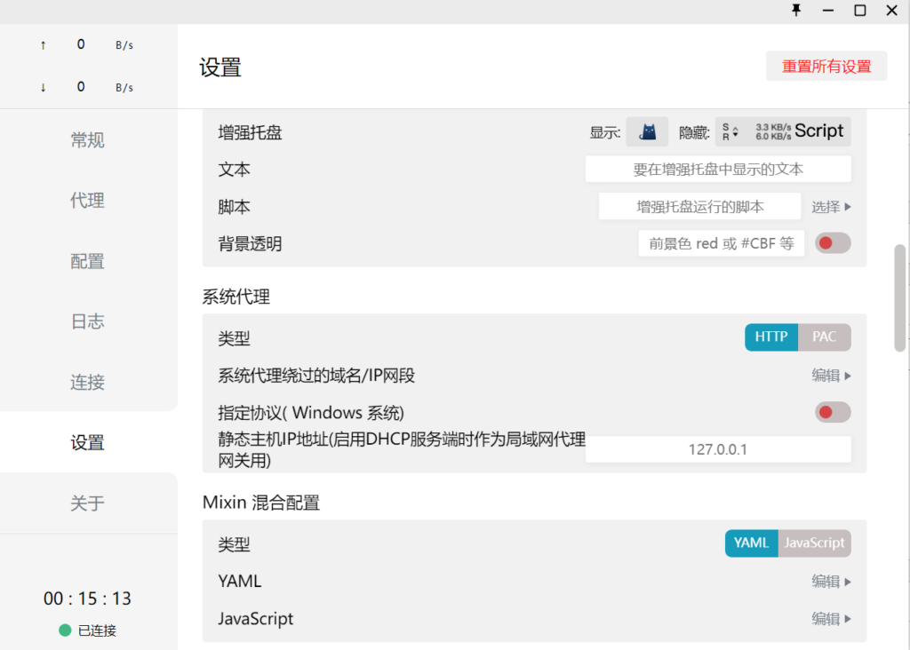
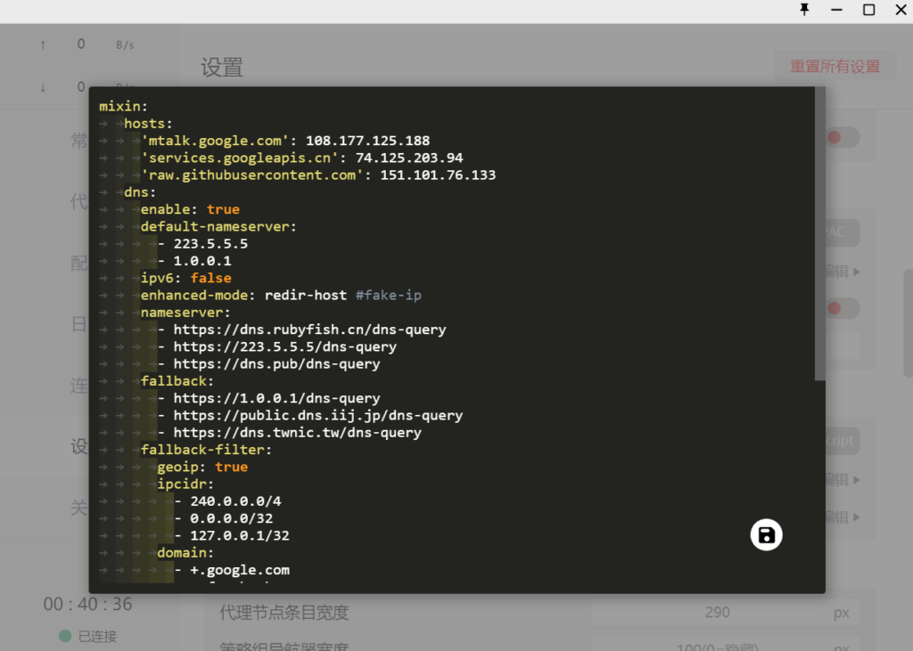
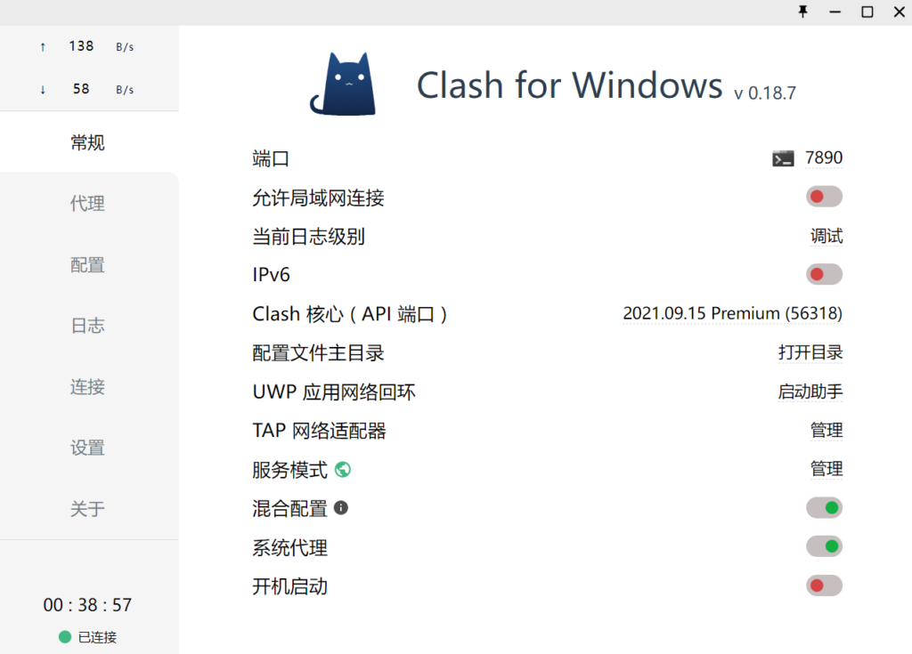
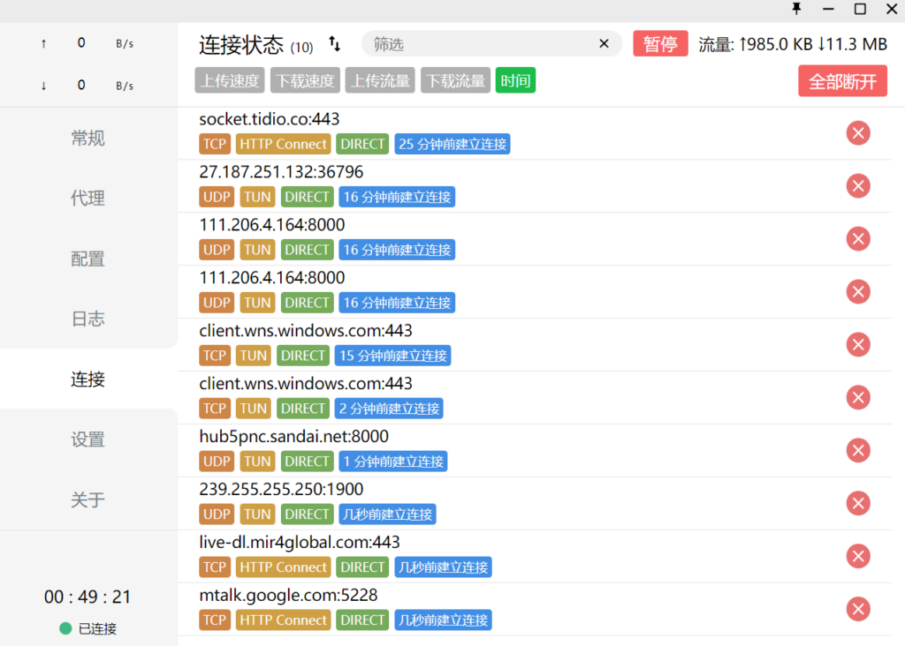
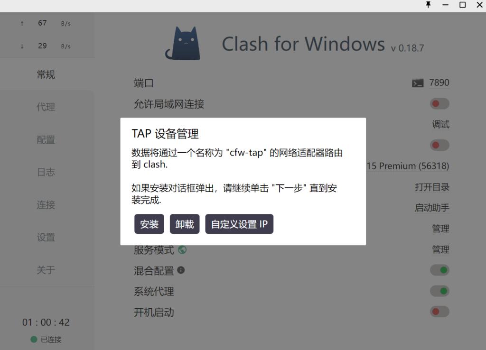
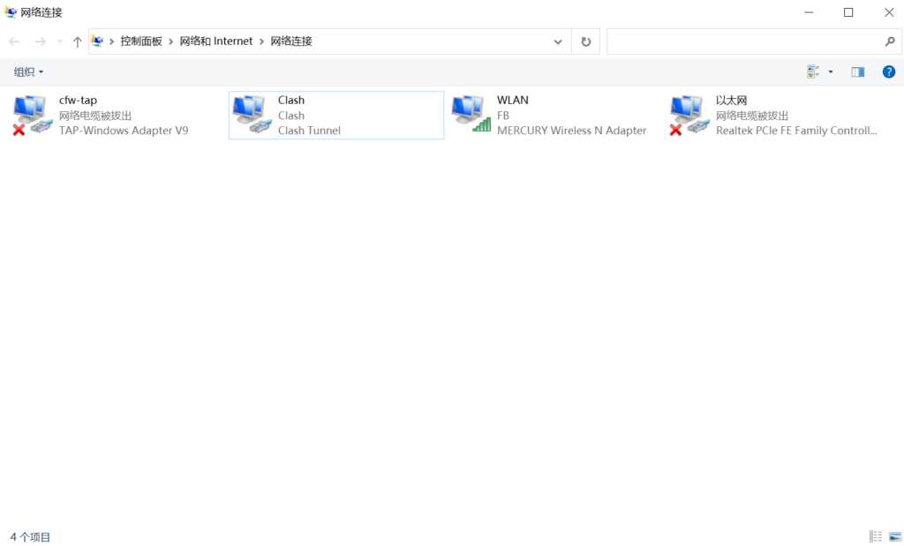
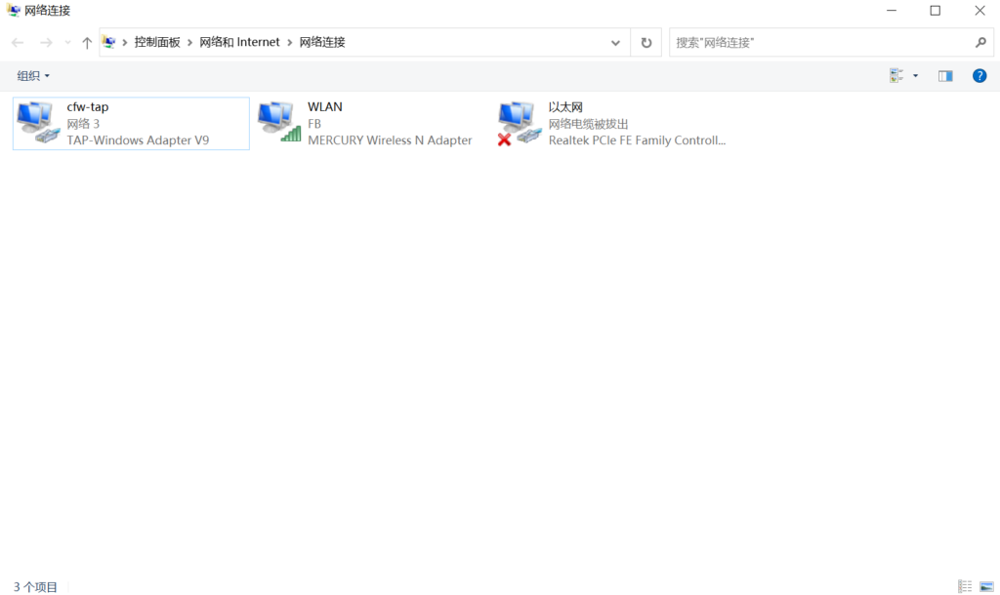
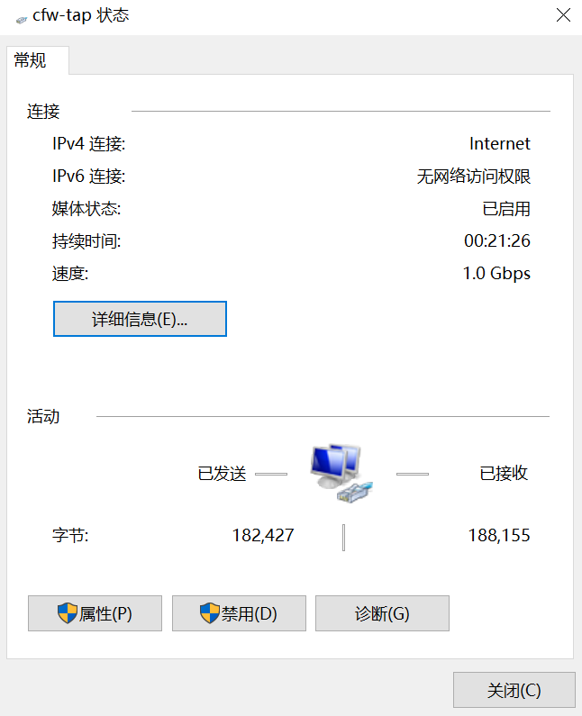

浏览器之类的应用都是使用系统代理访问的，有些时候一些非系统代理应用，例如玩游戏或者使用某个特定软件需要特定IP时，目前比较常见的V2ray或者Shadowsocks等代理工具，只能实现网页访问的代理功能。如何实现网卡层访问？接下来详细介绍[Clash for Windows](https://uzbox.com/tag/clash-for-windows)的[TAP虚拟网卡](https://uzbox.com/tag/tapxuniwangka)功能。

首先我们先了解一下，什么是Clash for Windows的TAP虚拟网卡功能。

### TUN/TAP模式

在Windows中对于不遵循系统代理的软件，TAP 模式可以接管其流量并交由 CFW 处理。对于 0.13.8 及以后版本，更推荐使用TUN 模式。安装虚拟网卡功能后可以实现全局代理！

### 配置TUN/TAP模式

当前Clash for Windows最新版本是V0.18.7，推荐使用TUN模式

首先下载最新版本的Clash for Windows，具体可以参考：[Clash for Windows 中文汉化教程](https://uzbox.com/tech/clash.html)

接下来安装TUN模式或者是TAP模式。

#### TUN模式

首先安装好汉化后的Clash for Windows最新版本后，打开软件！



在常规(General)页面中找到服务模式(Service Mode)，点击后面的管理(Manage)。点击之后会弹出小窗口。


点击安装后，软件会自动关闭然后会重新启动，安装成功后，服务模式后面的灰色地球的图标会点亮变成绿色。图标变成绿色后，TUN模式安装成功！

接下来点击设置(Settings),在Mixin混合配置(Profile Mixin)下面找到YAML，点击后面的编辑。



将下列代码添加到YAML中：

**注意：下列代码中的空格缩进，一定要复制完整代码，不要删除代码前面的空格。**

```yaml
mixin: 
   hosts:
     'mtalk.google.com': 108.177.125.188
     'services.googleapis.cn': 74.125.203.94
     'raw.githubusercontent.com': 151.101.76.133
   dns:
     enable: true
     default-nameserver:
       - 223.5.5.5
       - 1.0.0.1
     ipv6: false
     enhanced-mode: redir-host #fake-ip
     nameserver:
       - https://dns.rubyfish.cn/dns-query
       - https://223.5.5.5/dns-query
       - https://dns.pub/dns-query
     fallback:
       - https://1.0.0.1/dns-query
       - https://public.dns.iij.jp/dns-query
       - https://dns.twnic.tw/dns-query
     fallback-filter:
       geoip: true
       ipcidr:
         - 240.0.0.0/4
         - 0.0.0.0/32
         - 127.0.0.1/32
       domain:
         - +.google.com
         - +.facebook.com
         - +.twitter.com
         - +.youtube.com
         - +.xn--ngstr-lra8j.com
         - +.google.cn
         - +.googleapis.cn
         - +.gvt1.com
   tun: 
     enable: true
     stack: gvisor
     dns-hijack:
       - 198.18.0.2:53
     macOS-auto-route: true
     macOS-auto-detect-interface: true # 自动检测出口网卡
```

然后点击右下角存盘图标，保存当前设置。



保存之后，返回到主界面，将混合配置(Mixin)后面的开关启用，变成绿色后，TUN模式成功开启。



TUN模式成功开启后，在连接菜单下查看，连接状态中都包含了TUN的标志。



好了TUN模式已经开启成功了，不过有一些软件或者游戏TUN模式还是无法满足功能需求，下面介绍TAP虚拟网卡。

#### TAP模式

首先需要安装TAP虚拟网卡，点击常规(General)页面中TAP网络适配器(TAP Device)选项后面的管理(Manage)按钮，在弹出对话框中点击安装(Install)将会安装TAP网卡，TAP网卡用于接管系统流量。



安装完成后，可以在Windows系统的网络连接中看到名为cfw-tap的网卡，此时的网卡还是未连接状态。



现在存在一个Clash的网卡是在活动状态，如果你之前安装了TUN模式，需要先卸载TUN模式后，才能安装TAP模式。卸载TUN，在常规中点击服务模式，然后点击卸载就可以了，卸载后，服务模式后面的地球图标变成灰色，就表示卸载成功了。

TAP模式安装成功后需要启动TAP模式。启动TAP模式和之前启动TUN模式一样，都需要重新编辑YAML。


将下面代码添加到窗口里，点击右下角存盘标志保存文件。

```yaml
mixin: 
  dns:
    enable: true    
    enhanced-mode: redir-host
    listen: :53
#    listen: 0.0.0.0:53
    nameserver: 
#    - 8.8.8.8 # 真实请求DNS，可多设置几个
      - https://doh.dns.sb/dns-query
      - https://dns.adguard.com/dns-query
      - https://cdn-doh.ssnm.xyz/dns-query
      - 119.29.29.29 #腾讯
      - 223.5.5.5 #阿里
```

之后返回到常规中，将混合配置后面的开关拨动，激活TAP模式，在网络连接中查看cfw-tap网卡的模式，已经成功被激活了。



此时的cfw-tap网卡上已经有流量流入流出了。



现在已经可以通过cfw-tap网卡正常访问了！

Clash配置文件错误检测：https://clash.skk.moe/