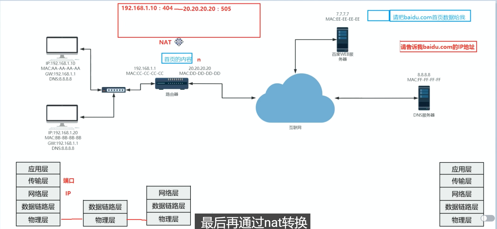
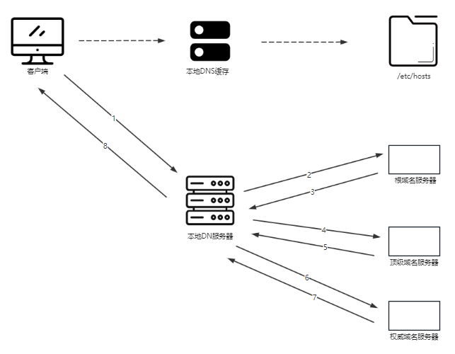
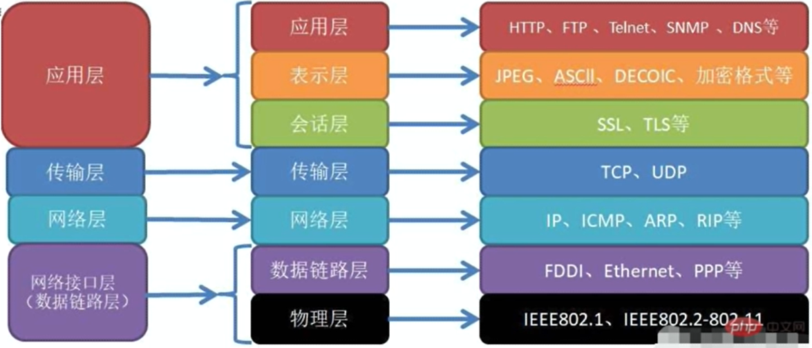
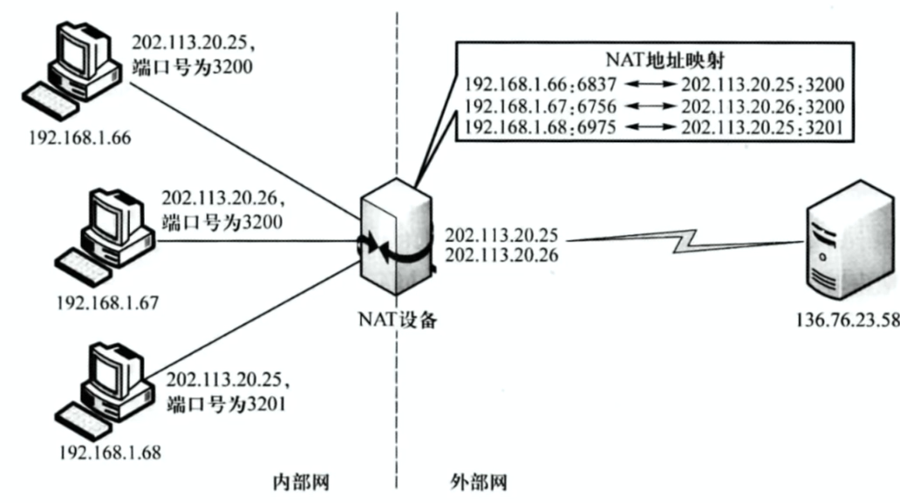

# IP的作用

```
IP（Internet Protocol）的作用是在互联网中标识和定位设备。每个连接到互联网的设备都被分配一个唯一的IP地址，通过这个地址，其他设备可以与之进行通信和交互。IP地址可以用来标识设备的位置，类似于电话号码或邮政地址。它允许数据包在网络中正确地路由和传递，确保数据能够准确地发送到目标设备。IP还提供了一种机制，使得数据包可以从一个网络传输到另一个网络，从而实现了互联网的全球性和互联性。总而言之，IP的作用是在互联网中提供设备标识和定位的功能，以及确保数据能够正确传输和路由的功能。
```


# 端口的作用

```
端口在计算机网络中起着非常重要的作用，它用于标识和区分不同的应用程序或服务。具体来说，端口是一个数字，范围从0到65535，用于在传输层中标识不同的应用程序或服务。

端口的作用主要有以下几个方面：

1. 提供应用程序或服务的访问点：每个运行在计算机上的应用程序或服务都可以通过一个特定的端口来提供访问点。例如，Web服务器通常使用80端口提供HTTP服务，SMTP服务器使用25端口提供电子邮件服务。

2. 区分不同的应用程序或服务：通过使用不同的端口号，可以区分不同的应用程序或服务。这样，网络中的数据包就可以根据目标端口号被正确地路由到相应的应用程序或服务。

3. 实现多路复用：通过使用端口，多个应用程序或服务可以在同一台计算机上同时运行，而不会相互干扰。每个应用程序或服务都可以监听自己指定的端口，从而实现数据的并行传输和处理。

4. 提供安全性和访问控制：通过控制端口的访问权限，可以实现对网络中的应用程序或服务的安全性和访问控制。只有被授权的用户或设备才能够通过特定的端口与应用程序或服务进行通信。

总而言之，端口的作用是提供应用程序或服务的访问点，区分不同的应用程序或服务，实现多路复用以及提供安全性和访问控制。
```


# MAC地址的作用

```
MAC地址（Media Access Control Address）是网络设备（如计算机、路由器、交换机等）在网络中的唯一标识符。它由48位二进制数表示，通常以十六进制表示，由6组冒号或破折号分隔。

MAC地址的作用主要有以下几个方面：

1. 唯一标识设备：每个网络设备都有一个独特的MAC地址，用于在局域网中唯一标识设备。这样，网络中的其他设备可以通过MAC地址识别和定位特定的设备。

2. 数据链路层寻址：在数据链路层，MAC地址用于标识数据包的源和目标设备。当数据包在局域网中传输时，路由器或交换机使用MAC地址来正确地路由和传递数据包。

3. 控制数据包的传输：通过MAC地址，网络设备可以根据目标MAC地址判断是否接收或转发数据包。只有目标MAC地址与设备的MAC地址匹配，设备才会接收或处理该数据包。

4. 防止冲突和冗余：MAC地址的全球唯一性可以确保在网络中没有两个设备具有相同的MAC地址。这样可以避免冲突和冗余，保证数据包能够正确地传输和交换。

总而言之，MAC地址的作用是唯一标识设备、数据链路层寻址、控制数据包的传输以及防止冲突和冗余。它在局域网中起着重要的作用，确保网络设备能够正确地通信和交互。
```


# 交换机的作用

```
MAC地址（Media Access Control Address）是网络设备（如计算机、路由器、交换机等）在网络中的唯一标识符。它由48位二进制数表示，通常以十六进制表示，由6组冒号或破折号分隔。

MAC地址的作用主要有以下几个方面：

1. 唯一标识设备：每个网络设备都有一个独特的MAC地址，用于在局域网中唯一标识设备。这样，网络中的其他设备可以通过MAC地址识别和定位特定的设备。

2. 数据链路层寻址：在数据链路层，MAC地址用于标识数据包的源和目标设备。当数据包在局域网中传输时，路由器或交换机使用MAC地址来正确地路由和传递数据包。

3. 控制数据包的传输：通过MAC地址，网络设备可以根据目标MAC地址判断是否接收或转发数据包。只有目标MAC地址与设备的MAC地址匹配，设备才会接收或处理该数据包。

4. 防止冲突和冗余：MAC地址的全球唯一性可以确保在网络中没有两个设备具有相同的MAC地址。这样可以避免冲突和冗余，保证数据包能够正确地传输和交换。

总而言之，MAC地址的作用是唯一标识设备、数据链路层寻址、控制数据包的传输以及防止冲突和冗余。它在局域网中起着重要的作用，确保网络设备能够正确地通信和交互。
```


# 路由器(网关)的作用  

```
MAC地址（Media Access Control Address）是网络设备（如计算机、路由器、交换机等）在网络中的唯一标识符。它由48位二进制数表示，通常以十六进制表示，由6组冒号或破折号分隔。

MAC地址的作用主要有以下几个方面：

1. 唯一标识设备：每个网络设备都有一个独特的MAC地址，用于在局域网中唯一标识设备。这样，网络中的其他设备可以通过MAC地址识别和定位特定的设备。

2. 数据链路层寻址：在数据链路层，MAC地址用于标识数据包的源和目标设备。当数据包在局域网中传输时，路由器或交换机使用MAC地址来正确地路由和传递数据包。

3. 控制数据包的传输：通过MAC地址，网络设备可以根据目标MAC地址判断是否接收或转发数据包。只有目标MAC地址与设备的MAC地址匹配，设备才会接收或处理该数据包。

4. 防止冲突和冗余：MAC地址的全球唯一性可以确保在网络中没有两个设备具有相同的MAC地址。这样可以避免冲突和冗余，保证数据包能够正确地传输和交换。

总而言之，MAC地址的作用是唯一标识设备、数据链路层寻址、控制数据包的传输以及防止冲突和冗余。它在局域网中起着重要的作用，确保网络设备能够正确地通信和交互。
```


# 域名的作用

```
域名的作用是为了方便人们记忆和访问互联网上的资源，它是互联网上的网站、邮箱等资源的地址标识。

具体来说，域名的作用包括以下几个方面：

1. 方便记忆：域名由一串字符组成，通常与网站的名称或内容相关联，比如www.example.com。相比于IP地址（如192.168.0.1），域名更容易被人们记忆和输入，提供了更友好的用户体验。

2. 网站标识：域名是一个网站的唯一标识，每个网站都有一个独特的域名。通过在浏览器中输入域名，用户可以直接访问特定的网站。

3. 网站定位：域名的结构通常包括顶级域名（如.com、.org、.cn等）、二级域名（如example）和三级域名（如www）。这种层级结构可以帮助用户快速了解网站的性质、所属组织或国家等信息。

4. 邮箱使用：域名也可以用于创建个性化的电子邮件地址。通过在域名后面添加特定的标识，用户可以拥有自己的专属邮箱地址，如info@example.com。

5. 品牌建设：域名可以与企业、品牌或个人身份相关联，成为品牌建设的一部分。一个独特、易记的域名可以增加品牌的知名度和可信度。

总而言之，域名的作用是为了方便人们记忆和访问互联网上的资源，提供了更友好的用户体验。它是网站标识、定位工具，也可以用于创建个性化的电子邮件地址，同时还可以成为品牌建设的一部分。
```


# DNS的作用

```
DNS（Domain Name System）的作用是将域名转换为对应的IP地址，以便在互联网上进行资源的定位和访问。

具体来说，DNS的作用包括以下几个方面：

1. 域名解析：DNS将用户输入的域名（如www.example.com）解析为对应的IP地址（如192.168.0.1）。这样，用户在浏览器中输入域名时，DNS会将域名解析为IP地址，然后将请求发送给对应的服务器。

2. IP地址管理：DNS作为一个分布式的系统，负责管理和维护全球范围内的IP地址与域名的对应关系。它将域名和IP地址进行映射，并提供域名和IP地址之间的转换服务。

3. 负载均衡：DNS可以根据服务器的负载情况，将用户的请求分配到不同的服务器上，实现负载均衡。通过将请求分散到多个服务器上，可以提高系统的性能和可靠性。

4. 故障转移：DNS可以在服务器故障或不可用时，将用户的请求转发到备用服务器上。这样可以确保即使某个服务器出现故障，用户仍然能够访问到相应的资源。

5. 缓存功能：DNS服务器可以缓存域名解析结果，以减少对上层DNS服务器的查询次数，提高解析的速度和效率。缓存功能还可以减轻DNS服务器的负载，提高系统的整体性能。

总而言之，DNS的作用是将域名解析为对应的IP地址，实现域名和IP地址之间的映射。它管理和维护全球范围内的IP地址与域名的对应关系，实现负载均衡和故障转移，提供缓存功能，以提高系统的性能、可靠性和效率。
```


# NAT的作用

```
NAT（Network Address Translation）的作用是在网络中实现私有IP地址和公共IP地址之间的转换，以便多个设备共享一个公共IP地址。

具体来说，NAT的作用包括以下几个方面：

1. IP地址转换：NAT将内部网络中的私有IP地址转换为公共IP地址，以便在互联网上进行通信。这样，多个设备可以使用相同的公共IP地址与外部网络进行通信。

2. IP地址隐藏：NAT可以隐藏内部网络的私有IP地址，使外部网络无法直接访问内部网络中的设备。这提高了网络的安全性，防止外部网络对内部网络的直接攻击。

3. IP地址重用：由于IP地址资源有限，NAT可以通过将多个内部设备使用同一个公共IP地址进行通信，实现IP地址的重用。这样可以节省IP地址资源，提高网络的可扩展性。

4. 网络隔离：NAT可以将内部网络划分为不同的子网，并使用不同的公共IP地址进行转换，实现网络的隔离。这样可以提高网络的安全性和管理灵活性。

5. 端口转换：NAT还可以将内部网络中的私有IP地址和端口号转换为公共IP地址和端口号，以实现多个设备之间的端口复用。这样可以支持多个设备同时使用同一个公共IP地址进行通信。

总而言之，NAT的作用是在网络中实现私有IP地址和公共IP地址之间的转换，以便多个设备共享一个公共IP地址。它实现了IP地址转换、IP地址隐藏、IP地址重用、网络隔离和端口转换等功能，提高了网络的安全性、可扩展性和管理灵活性。
```









